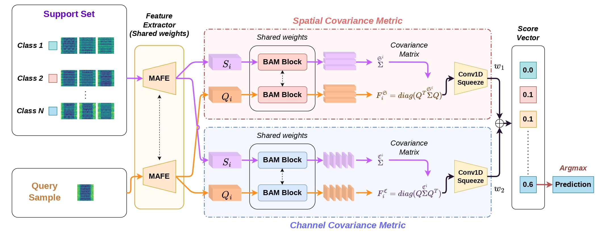
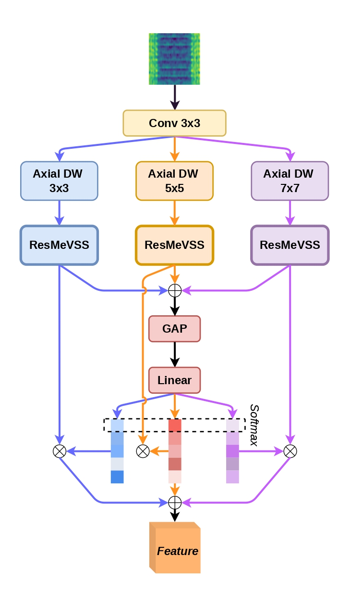
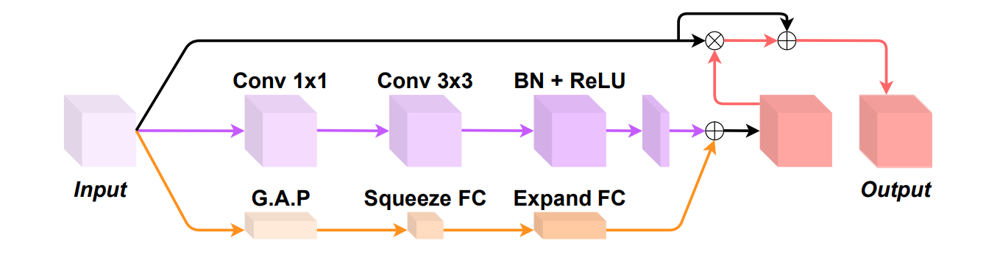

# Bi-CovaSC: A Few-Shot Learning Model with Multi-Scale Feature and Covariance Bi-Metric Learning for Bearing Fault Diagnosis

**Paper:** [https://ieeexplore.ieee.org/abstract/document/11142101]

 ---

## Architecture of the proposed model

### Main Architecture: BiCovaSC


### Feature Extractor Block: Mamba Aggregrate Feature Extractor


### Attention Block: Bottleneck Attention Module



## Requirements

- Python ≥ 3.8  
- Linux OS  
- PyTorch ≥ 0.4  
- NVIDIA GPU with CUDA + cuDNN  

---

## Datasets

This work evaluates performance on two benchmark bearing fault datasets:

- **CWRU** — Case Western Reserve University Bearing Dataset  
  https://engineering.case.edu/bearingdatacenter  

- **PU** — Paderborn University Bearing Dataset  
  [https://mb.uni-paderborn.de/kat/forschung/kat-datacenter/bearing-datacenter/data-sets-and-download](https://mb.uni-paderborn.de/kat/forschung/bearing-datacenter/data-sets-and-download)  

---


## Contact
If you have any questions about this reposition, you can contact me via emails:

viet.nvq222715@sis.hust.edu.vn or nguyenvanquocviet011@gmail.com
## Citation
If you feel this code is useful, please give us 1 ⭐ and cite our paper.
```bash
@inproceedings{nguyen2025bi,
  title={Bi-CovaSC: A Few-Shot Learning Model with Multi-Scale Feature and Covariance Bi-Metric Learning for Bearing Fault Diagnosis},
  author={Nguyen, Duy-Thai and Pham, Van-Truong and Tran, Thi-Thao and others},
  booktitle={2025 10th International Conference on Applying New Technology in Green Buildings (ATiGB)},
  pages={218--223},
  year={2025},
  organization={IEEE}
}
```
